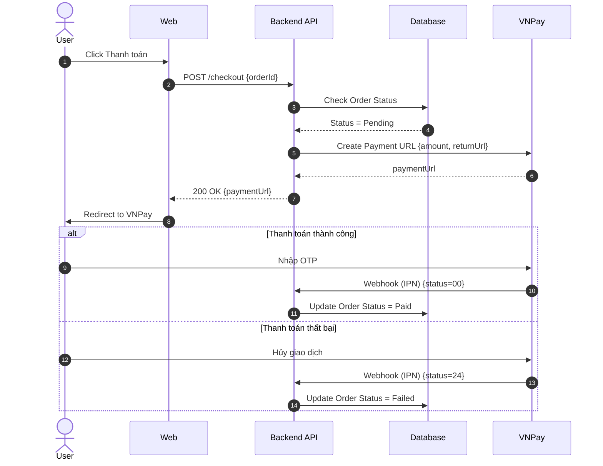

# Vẽ Sequence Diagram

## Level
Level 3 - Architecture Skill

## Purpose
Mô hình hóa luồng giao tiếp (Tương tác) giữa các đối tượng (Người dùng, Frontend, Backend, Database, 3rd Party API) theo trình tự thời gian. Giúp team Dev hiểu rõ thứ tự gọi API và luồng dữ liệu.

## When to Use
Sử dụng khi thiết kế luồng đăng nhập (SSO/OAuth), tích hợp cổng thanh toán (VNPay, Momo), hoặc các luồng nghiệp vụ phức tạp đòi hỏi nhiều hệ thống tham gia.

## Prerequisites
- Đã có API Contract hoặc luồng nghiệp vụ
- Hiểu kiến trúc hệ thống cơ bản

## Inputs
### Luồng nghiệp vụ phức tạp
- **Mô tả:** Mô tả tương tác giữa các hệ thống.
- **Bắt buộc:** Có
- **Ví dụ:** User thanh toán VNPay: User click thanh toán → Web gọi Backend → Backend gọi VNPay tạo URL → Trả về Web → Web redirect sang VNPay → User quẹt thẻ → VNPay gọi Webhook về Backend.

## Process
### Bước 1: Xác định Lifelines (Đối tượng)
Ai/Cái gì tham gia vào luồng?

- Liệt kê các thành phần: Actor (User), Frontend (Web/App), API Server, Database, 3rd Party (VNPay, SendGrid, Firebase)

### Bước 2: Vẽ các Message (Lời gọi) theo thời gian
Trình tự gọi hàm/API từ trên xuống dưới.

- Synchronous Message (Mũi tên nét liền, mũi nhọn): Đợi phản hồi (VD: API Call `POST /checkout`)
- Asynchronous Message (Mũi tên nét liền, mũi hở): Gọi và không cần chờ ngay (VD: Publish message to Queue)
- Return Message (Mũi tên nét đứt): Trả về kết quả (VD: Trả về URL thanh toán)

### Bước 3: Sử dụng Fragments (Khối logic)
Thể hiện rẽ nhánh hoặc vòng lặp.

- Alt (Alternative / If-Else): Nếu thẻ hợp lệ → Trừ tiền. Ngược lại → Báo lỗi.
- Opt (Optional / If): Khối chỉ thực hiện khi thỏa điều kiện (VD: Nếu User dùng Voucher thì gọi API kiểm tra Voucher).
- Loop (Vòng lặp): Chạy nhiều lần (VD: Gửi thông báo cho từng người trong danh sách).

### Bước 4: Bổ sung tham số (Payload/Response)
Ghi rõ truyền cái gì và nhận cái gì.

- Trên mũi tên gọi: Ghi rõ method và tham số quan trọng (VD: `POST /payment {amount, orderId}`)
- Trên mũi tên trả về: Ghi rõ HTTP Status hoặc dữ liệu chính (VD: `200 OK {paymentUrl}`)

## Outputs
### Sequence Diagram
- **Định dạng:** Mermaid sequenceDiagram
- **Mẫu:**

```

```

## Sub-Skills (Kỹ năng con)
- System Identification
- API Flow Design
- Fragment Logic (Alt/Opt/Loop)

## Business Rules
- BR-SEQ-01: Trình tự thời gian phải chảy từ trên xuống dưới.
- BR-SEQ-02: API calls phải dùng mũi tên liền (Synchronous) và có Return message (mũi tên đứt).
- BR-SEQ-03: Bắt buộc dùng block 'Alt' nếu có nhánh Thành công / Thất bại.
- BR-SEQ-04: Actor (Người dùng) luôn nằm ngoài cùng bên trái.

## Edge Cases & Exceptions
- Hệ thống bên thứ 3 chậm (Timeout) → Xử lý Timeout bằng khối Alt
- Webhook (IPN) đến trễ hoặc đến trước Return URL → Thiết kế Idempotent (Chống trùng lặp)

## Checklist
- [ ] Đã đủ các Lifeline (FE, BE, DB, 3rd Party)?
- [ ] Đã phân biệt Sync và Async Message?
- [ ] Đã ghi tham số Input/Output trên mũi tên chưa?
- [ ] Đã có khối Alt cho Happy Path và Negative Path?
- [ ] Actor có ở bên trái cùng không?
- [ ] Code Mermaid đã chạy được chưa?

## Example
Xem ví dụ thanh toán VNPay trong Outputs.

## Related Skills
- Thiết kế API Contract
- Vẽ BPMN
