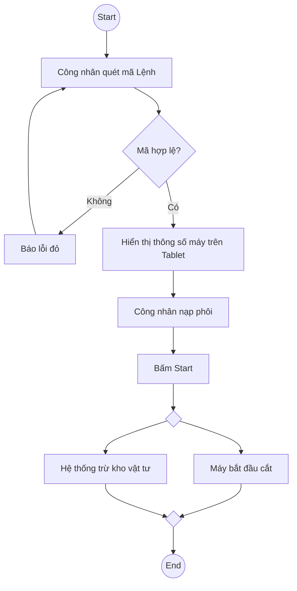

# Activity Diagram

## Level
Level 2 - Business Skill

## Purpose
Mô hình hóa luồng hoạt động (Workflow) và thao tác nghiệp vụ, đặc biệt hiệu quả để mô tả thao tác vật lý của con người kết hợp với phản hồi của máy móc/hệ thống tại dưới xưởng (Shopfloor).

## When to Use
Dùng để phác thảo nhanh một quy trình, một thuật toán, hoặc thao tác tại một Trạm làm việc (Work Center) trước khi code.

## Prerequisites
- Hiểu các bước thực hiện của quy trình

## Inputs
### Quy trình vật lý / hệ thống
- **Mô tả:** Chuỗi các bước thực hiện.
- **Bắt buộc:** Có
- **Ví dụ:** Công nhân lại máy tiện -> Quét mã vạch -> Máy tính bảng báo xanh -> Nhấn nút chạy -> QC lấy mẫu đo.

## Process
### Bước 1: Liệt kê các Action Nodes (Hành động)
Các thao tác cụ thể.

- Bao gồm thao tác vật lý: Lấy phôi thép, đo kích thước bằng thước kẹp.
- Bao gồm thao tác phần mềm: Quét mã vạch, Bấm nút Start trên Tablet.

### Bước 2: Sử dụng Decision Nodes (Rẽ nhánh)
Các điểm kiểm tra.

- VD: QC đo kích thước -> [Pass] -> Chuyển bước tiếp theo. [Fail] -> Cho vào thùng phế phẩm (Scrap).

### Bước 3: Sử dụng Fork/Join (Luồng song song)
Các việc xảy ra cùng lúc.

- Fork (Tách luồng): Hệ thống MES vừa ghi nhận số lượng VÀ vừa kích hoạt đèn báo xanh.
- Join (Gộp luồng): Phải hoàn thành cả việc [Máy cắt xong] VÀ [Công nhân dọn phoi] thì mới qua bước [Chuyển hàng].

### Bước 4: Phân chia Swimlanes (Tùy chọn)
Ai làm việc gì?

- Chia cột: Công nhân (Operator) | Hệ thống MES | Quản lý Chất lượng (QC).

## Outputs
### Activity Diagram (Mermaid)
- **Định dạng:** Mermaid flowchart
- **Mẫu:**

```

```

## Sub-Skills (Kỹ năng con)
- Fork/Join Logic
- Physical/System Interaction

## Business Rules
- BR-ACT-01: Mọi nhánh rẽ từ khối Decision (Hình thoi) phải có nhãn rõ ràng (Đúng/Sai, Pass/Fail).
- BR-ACT-02: Phải mô tả chân thực sự tương tác giữa vật lý (cầm, nắm, quét) và hệ thống.

## Edge Cases & Exceptions
- Máy mất kết nối mạng (Offline) khi đang chạy -> Activity Diagram phải mô tả luồng lưu cache cục bộ trên Tablet.

## Checklist
- [ ] Có Start và End node?
- [ ] Khối Decision đã cover đủ nhánh (vd Yes/No)?
- [ ] Có sử dụng luồng song song (Fork) khi máy và người cùng làm việc không?

## Example
Xem sơ đồ Mermaid trong Outputs.

## Related Skills
- Phân tích Mobile App
- Thiết kế Role-based UI
