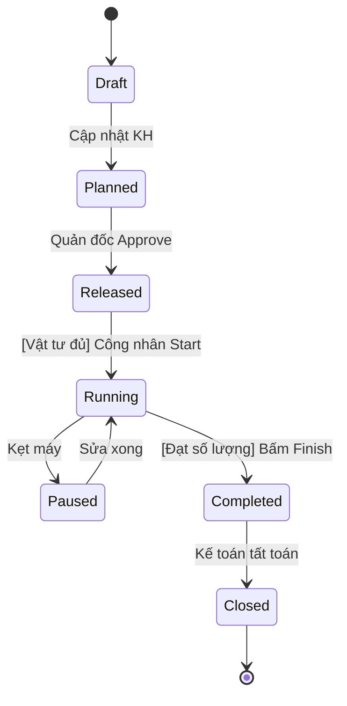

# State Machine Diagram

## Level
Level 3 - Architecture Skill

## Purpose
Đặc tả vòng đời (Lifecycle) của một thực thể nghiệp vụ cốt lõi (Ví dụ: Lệnh sản xuất, Lô hàng, Máy móc) từ lúc sinh ra đến lúc kết thúc. Cung cấp chi tiết các Trạng thái (States), Sự kiện kích hoạt (Triggers), và Điều kiện chặn (Guard Conditions).

## When to Use
Sử dụng cực kỳ thường xuyên trong các hệ thống lõi (MES, ERP, Core Banking) nơi dữ liệu không bao giờ bị xóa vật lý (Hard delete) mà chỉ thay đổi trạng thái theo vòng đời khắt khe.

## Prerequisites
- Xác định được thực thể chính cần quản lý trạng thái (Ví dụ: Production Order)

## Inputs
### Tên Thực thể (Entity)
- **Mô tả:** Đối tượng cần phân tích.
- **Bắt buộc:** Có
- **Ví dụ:** Lệnh sản xuất (Production Order)

### Luồng nghiệp vụ (Business Flow)
- **Mô tả:** Cách thực thể này hoạt động thực tế.
- **Bắt buộc:** Có
- **Ví dụ:** Lệnh tạo ra -> Chờ cấp vật tư -> Đang chạy -> Đóng lệnh.

## Process
### Bước 1: Xác định các Trạng thái (States)
Các cột mốc tĩnh.

- Bắt đầu (Initial State) và Kết thúc (Final State).
- Các trạng thái trung gian. VD cho MES: Draft, Planned, Released, Setup, Running, Paused, Completed, Closed, Canceled.

### Bước 2: Xác định Hành động chuyển trạng thái (Transitions & Triggers)
Cái gì làm thay đổi trạng thái?

- Hành động của user (VD: Quản đốc bấm 'Release').
- Tín hiệu từ máy móc (VD: Cảm biến PLC báo 'Machine Started').
- Hành động của hệ thống (VD: Scheduled Job chạy vào nửa đêm).

### Bước 3: Thiết lập Điều kiện chặn (Guard Conditions)
Rule để được phép chuyển.

- VD: [Đã cấp đủ vật tư] thì mới được chuyển từ Released -> Running.
- VD: [QC Passed] thì mới được chuyển từ Running -> Completed.

### Bước 4: Hành động khi vào/ra trạng thái (Entry/Exit Actions)
Hệ thống tự làm gì khi đổi state?

- Entry Action (Khi vào trạng thái): VD Khi vào 'Running' -> Gửi Zalo cho Quản đốc báo máy bắt đầu chạy.
- Exit Action (Khi rời trạng thái): VD Khi rời 'Paused' -> Ghi nhận tổng thời gian Downtime.

## Outputs
### State Machine Diagram (Mermaid)
- **Định dạng:** Mermaid stateDiagram
- **Mẫu:**

```

```

### State Transition Table
- **Định dạng:** Markdown Table
- **Mẫu:**

```
### Ma trận chuyển đổi trạng thái (State Matrix)
| Từ trạng thái (From) | Đến trạng thái (To) | Trigger (Sự kiện) | Guard (Điều kiện) | Action (Hệ thống làm gì) |
|---|---|---|---|---|
| Released | Running | Công nhân bấm 'Start' | Đã cấp đủ vật tư | Ghi nhận thời gian bắt đầu |
| Running | Completed | Đạt Target SL | SL Đạt + SL Lỗi = Target | Gửi Noti cho Kế toán kho |
```

## Sub-Skills (Kỹ năng con)
- Guard Condition Analysis
- Lifecycle Design

## Business Rules
- BR-STATE-01: Một thực thể tại một thời điểm chỉ có duy nhất 1 trạng thái.
- BR-STATE-02: Mọi State đều phải có đường đi đến Final State (Không tạo Trạng thái chết / Dead-end).

## Edge Cases & Exceptions
- Công nhân bấm nhầm trạng thái (Ví dụ từ Released bấm nhầm sang Closed) -> Thiết kế các flow 'Reopen' hoặc chặn cứng trên UI.

## Checklist
- [ ] Có Initial và Final state chưa?
- [ ] Mỗi mũi tên chuyển đều có mô tả Trigger chưa?
- [ ] Có các điều kiện chặn (Guard) cho các bước quan trọng không?
- [ ] Bảng State Matrix có khớp với sơ đồ Mermaid không?

## Example
Xem State Matrix mẫu trong phần Outputs.

## Related Skills
- Phân tích Production Order
- Phân tích Business Rules
